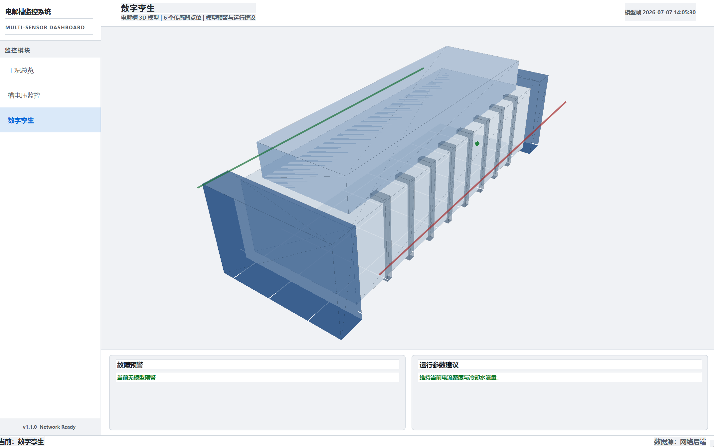
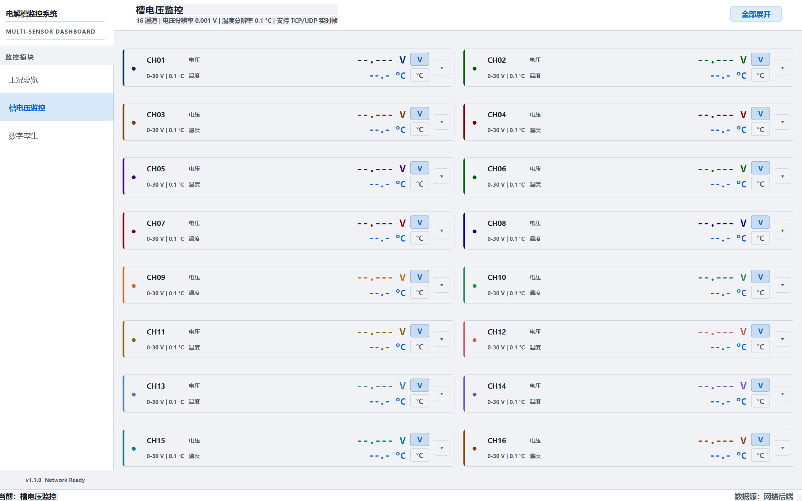
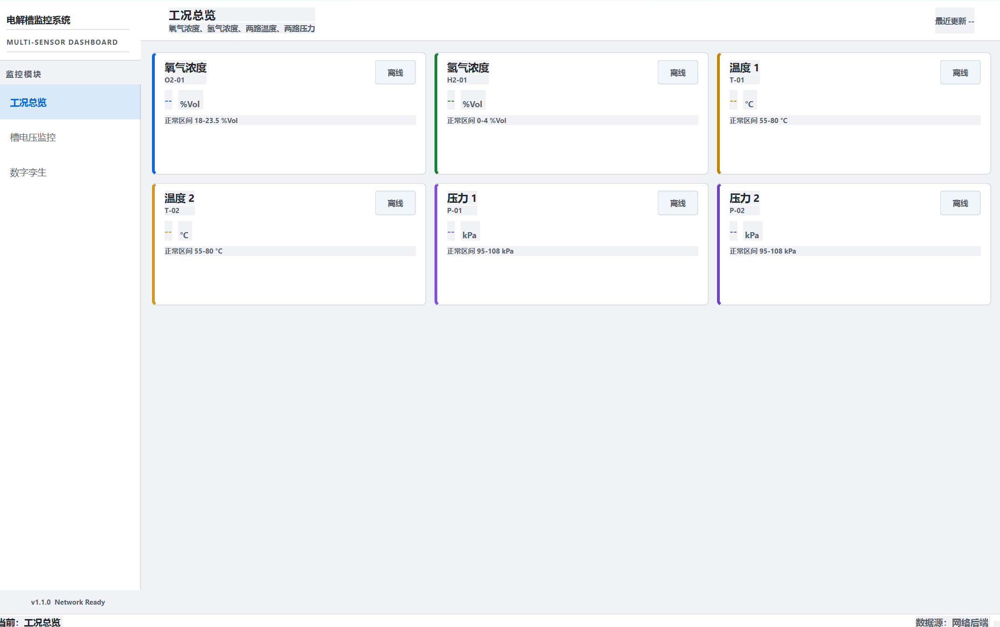
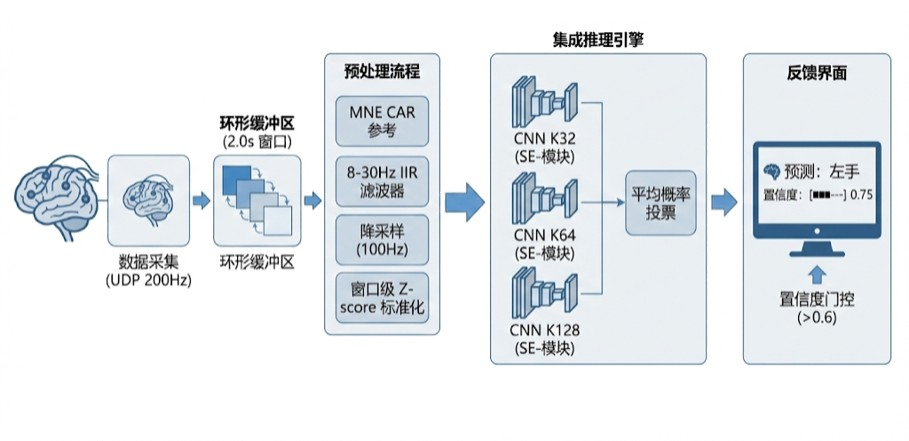
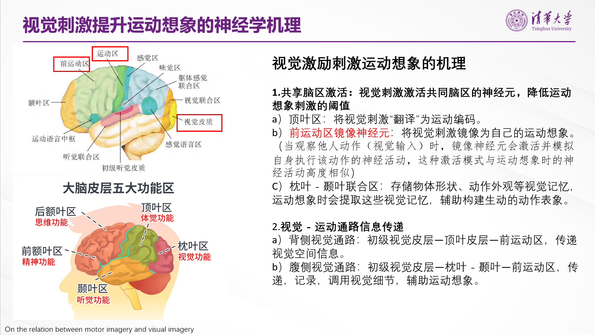
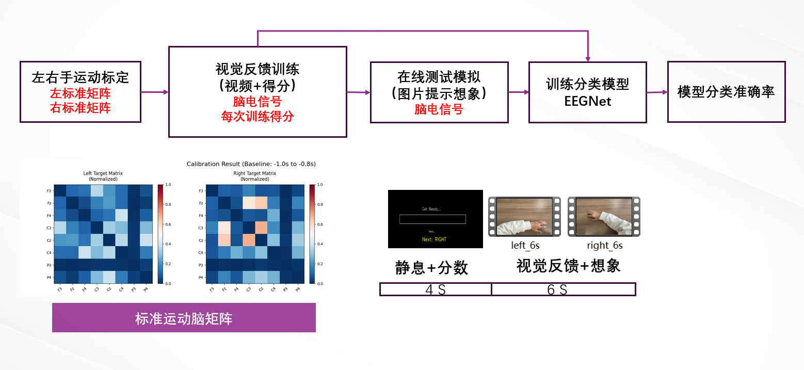
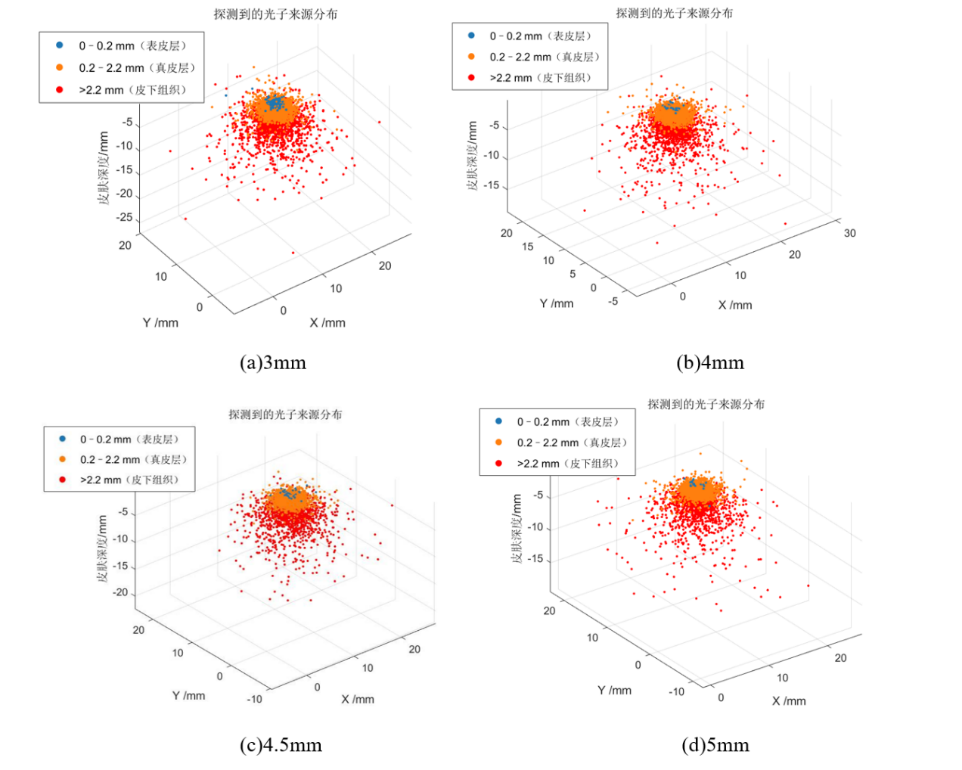
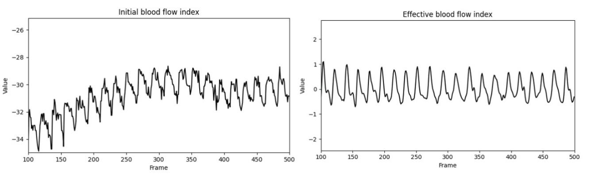
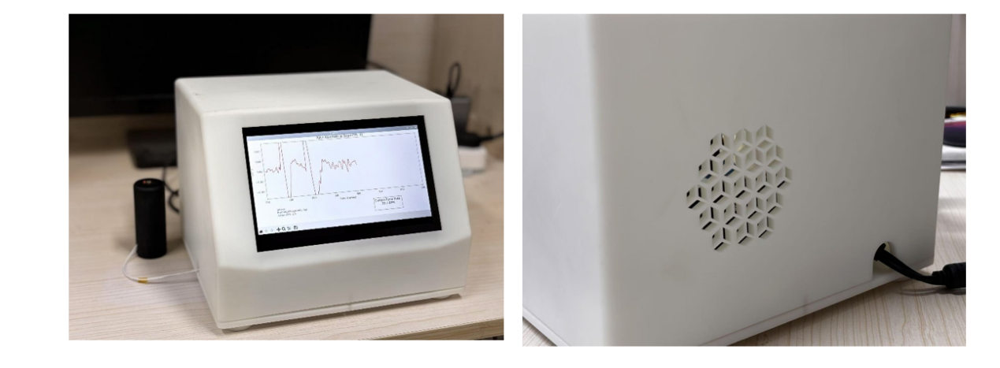

# Welcome to my Profile !

**AI for Sensing Systems · Digital Twins · World Models · Biomedical Signal Intelligence**

I am a graduate student at **Tsinghua University**, working at the intersection of **instrument science, artificial intelligence, signal processing, and intelligent sensing systems**.

My interests lie in developing AI models that can understand, reconstruct, and predict complex physical and biological signals, with applications in industrial digital twins, world models, EEG/BCI systems, wearable sensing, and scientific instrumentation.

---

## Research Interests

* **World Models & Physics-aware AI**
  Latent-space prediction, action-conditioned dynamics, physical constraint integration, and simulation-based learning.

* **Digital Twins & Multi-sensor Modeling**
  Sparse sensing, spatiotemporal reconstruction, anomaly detection, health-state estimation, and industrial system modeling.

* **EEG / BCI & Human-state Decoding**
  Motor imagery classification, real-time EEG processing, cognitive-state modeling, and neural feedback systems.

* **Biomedical & Wearable Sensing**
  Optical blood-flow monitoring, pulse-wave extraction, physiological signal processing, and portable sensing instruments.

* **Computer Vision for Measurement Systems**
  Image stitching, visual inspection, remote-sensing image classification, and vision-based sensing platforms.

---

## Selected Projects

### [CIST-MAE](https://github.com/field-mx/CIST-MAE)

**Spatiotemporal physical-field learning for complex sensing scenarios**

* Developed a masked modeling framework for learning spatiotemporal representations from physical-field data.
* Focused on multi-channel reconstruction, sparse sensing, and physical-field pattern learning.
* Explored the use of self-supervised learning for complex measurement and sensing systems.

---

### [LeWorldModel Reproduction](https://github.com/field-mx/le-wm)

**Lightweight world model reproduction and extension**

* Reproduced and studied LeWM-style action-conditioned world models.
* Focused on joint-embedding predictive architecture, latent-space dynamics, and efficient world model training.
* Exploring physics-aware extensions for simulation-based prediction and decision-making.

---

### [Industrial Hydrogen Digital Twin](https://github.com/field-mx/Sensor_Dashboard)

**Multi-sensor state estimation and health monitoring for industrial systems**

* Built a spatiotemporal prediction framework for a 61-channel industrial sensing system.
* Studied sparse sensing, full-state reconstruction, and multi-sensor signal completion.
* Designed early-warning logic based on residual analysis, trend monitoring, and health-state estimation.

---

### [Real-time EEG Three-class BCI System](https://github.com/field-mx/SE-EEGNet-Real-time-EEG-Three-Class-Classification-Model)

**Real-time EEG decoding and online control**

* Implemented a real-time EEG classification system based on SE-EEGNet.
* Focused on online preprocessing, motor imagery classification, and real-time inference.
* Integrated EEG decoding with device-side communication and control.

---

### [EEG Training System with Visual Feedback](https://github.com/field-mx/EEG_TrainingSystemwithVisualFeedback)

**Visual-feedback EEG training for motor imagery**
  
   
* Designed an EEG training platform with real-time visual feedback.
* Explored mirror-neuron-inspired interaction for motor imagery training.
* Implemented signal acquisition, feedback visualization, and user interaction modules.

---

### [Wearable Blood-flow Monitoring System](https://github.com/field-mx/Blood_flow_testing_instruments)

**Portable diffuse-speckle-based physiological sensing**
  
  
  
* Developed a wearable optical sensing system for blood-flow and pulse-wave monitoring.
* Implemented single-exposure pulse-wave extraction and multi-exposure flow-index estimation.
* Combined hardware design, signal processing, and simulation analysis for biomedical instrumentation.

---

### Visual-Tactile 3D Reconstruction

**Vision-based tactile sensing and deformation-field reconstruction**

* Developed a visual-tactile sensing system for reconstructing three-dimensional deformation fields.
* Built a measurement pipeline involving optical imaging, calibration, and deformation estimation.
* Focused on accurate tactile perception for intelligent sensing and robotic interaction.

---

### [Image Stitching System](https://github.com/field-mx/image_stitching)

**Panoramic sensing and image-processing pipeline**

* Implemented image segmentation, feature extraction, registration, and stitching.
* Applied the system to panoramic detection and inspection scenarios.

---

### [Remote Sensing CNN Classification](https://github.com/field-mx/CNN_image_classifications)

**CNN-based remote-sensing image classification**

* Built a CNN-based classification pipeline for remote-sensing image data.
* Implemented dataset preprocessing, model training, evaluation, and visualization.

---

## Technical Skills

**Programming:** Python, C/C++, MATLAB, Shell
**Machine Learning:** PyTorch, TensorFlow/Keras, scikit-learn
**Signal Processing:** time-series analysis, EEG processing, physiological signal processing, anomaly detection
**Computer Vision:** OpenCV, image stitching, CNN-based classification, visual measurement
**Systems & Tools:** Git, Linux, Conda, Raspberry Pi, socket communication, data acquisition systems
**Research Topics:** self-supervised learning, multimodal learning, digital twins, world models, physics-aware AI

---

## Current Focus

I am currently working on:

* lightweight world models for action-conditioned prediction
* physics-aware representation learning for sensing systems
* multi-sensor digital twins for industrial state estimation
* EEG/BCI systems for human intention and cognitive-state decoding
* wearable physiological sensing and biomedical instrumentation

---

## Long-term Direction

My long-term goal is to build **AI systems that connect physical measurement, scientific instrumentation, and intelligent decision-making**.

I am particularly interested in research problems where models are not only accurate, but also **physically grounded, interpretable, robust, and deployable in real-world sensing environments**.

---

## Contact

* GitHub: [@field-mx](https://github.com/field-mx)
* Institution: Tsinghua University
* Research interests: AI for sensors, digital twins, world models, EEG/BCI, biomedical sensing
